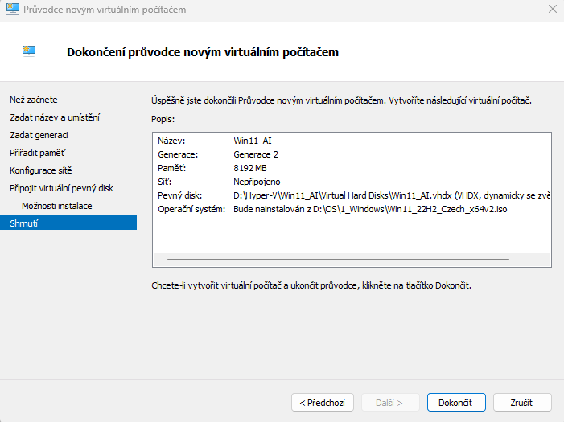
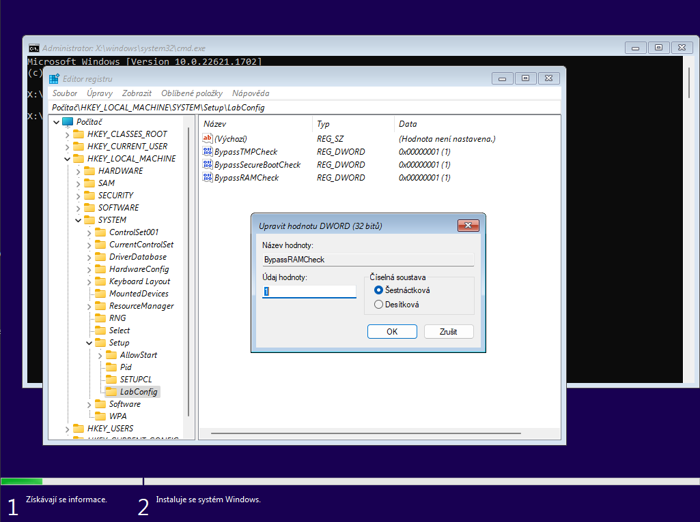
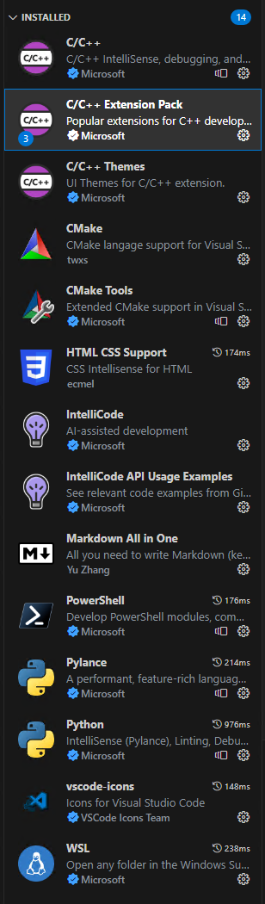

# AgentGPT - kompletní návad na instalaci
---
## Vytvoření virtuálního stroje  v VMware Workstation (nebo Hyper-V)
- alespoň 8GB RAM
- 100 GB disk  

- před spuštěním vypnout Secure Boot!
- před spuštěním nemít VM připojenou k síti!

1) Spustit VM (=Virtual Machine)
- vybrat jazyk, lokalizaci a klávesnici
- "Nemám Product key"
- zvolit Win 11 Pro !
- Objeví se hláška "Na tomhle počítači nejde spustit Win ."
    -  Shift+F10
    - v cmd zadat "regedit"
        - v Editoru registru vytvoříme nové klíče:
        - HKEY_LOCAL_MACHINE\SYSTEM\Setup -> pravou myší *Nový -> klíč* a nově vytvořenou složku pojmenovat "LabConfig"
            - v právé části okna kliknout *Nový->Hodnota DWORD (32 bitová)*
                - pojmenovat tuto novou hodnotu "BypassTPMCheck"
                - poté na tuto novou položku poklikat a zadat hodnotu "1" -> OK
            - ve stejné složce vytvořit druhou položku 
                - Hodnota DWORD (32 bitová)
                - název "BypassSecureBootCheck"
                - hodnota "1"
            - ve stejné složce třetí položku
                - Hodnota DWORD (32 bitová)
                - název "BypassRAMCheck"
                - hodnota "1"
                
    - zavřít Editor registru 
    - do cmd "exit"
    - křížkem v rohu zavřít okno "Na tomhle počítači nejde spustit Win 11." -> ANO
    - zopakovat postup, tentokát už to půjde
    - přijímám EULA, atd. standardní instalace...
2) Po zkopírování souborů proběhne restart (tady to může celkem dost minut motak kolečko s nápipsem "Probíhá příprava")
- https://pureinfotech.com/bypass-internet-connection-install-windows-11/
- zvolit oblast
- zvolit klávesnici (popřípadě přidat anglickou)
- v okně "Pojdmě se připojit k síti"
    - Shift+F10
    - zadat "OOBE\BYPASSNRO" + Enter -> sám se restartuje
- zopakovat předešlé kroky, ale u připojení bude přístupná možnost "Nemám internet" a "Pokračovat s omezenou instalací"
- zadat **login**, heslo, napsat nějaký nesmysly do otázek a odklikat diagnostiky

--- 
## Prvotní spuštění Win11
- aktualizace OS
- přejmenovat VM podle jmenné konvence (stejně jako hostující stroj, pouze s "v" místo "n" na začátku)
- nastavit si sdílenou složku mezi VM a hostem...
- instalace Visual Studio Code 
    - https://code.visualstudio.com/download
    - doinstalování pluginů, např.:  
    

- Instalace git 
    - https://git-scm.com/download/win
    - Cheat sheet pdf: https://training.github.com/downloads/github-git-cheat-sheet.pdf
    - v instalaci nechat *default* kromě:
        - *Choosing the default editor used by git* -> nastavit na *VS Code*
        - *Configuring the line ending conversions* -> *Checkout as-is, commit Unix-style line endings*
    - po instalaci je třeba dokončit základní nastavení:
        - spustit konzoli *Git Bash*
        - `git config --global user.name "VASE JMENO"` <-- radši bez diakritiky
        - `git config --global user.email "VAS EMAIL"` <-- @army.cz
    - zaregistrovat se na github.com s @army.cz mailem 

- instalace python 3.xx
    - v cmd napsat "python" --> otevře se Microsoft Store s Pythonem, kde kliknout na "Získat" (nebo samozřejmě nainstalovat odkudkoliv jinak...)
    - po instalaci otestovat v cmd příkazem ``python`` a pak ```exit()```


---
## Instalace Windows Subsystem for Linux (WSL)
- v cmd jako admin zadat `wsl --install`
    - pokud to při instalaci hodí error 0x80370114 nebo 0x80370102, 0x8004032d tak v:
    - jako admin v cmd 
        ```
        dism.exe /online /enable-feature /featurename:Microsoft-Hyper-V-All /featurename:VirtualMachinePlatform /featurename:Microsoft-Windows-Subsystem-Linux /all /norestart
        ```
    - nebo to samý naklikat v Nastavení -> Aplikace -> Volitelné součásti -> Další funkce systému Windows
        - zapnout vše, co půjde pod Hyper-V
        - zapnout Subsystém Windows pro Linux
        - zapnout Platforma virtualizace Windows
        - OK -> Restartovat nyní
    - otestovat, pokud nějaká chyba přetrá, tak v cmd jako admin `wsl.exe -set-default-version 1`
        - toto downgraduje verzi, ale pak to snad povalí
        - sources: https://superuser.com/questions/1736443/wsl-2-installing-linux-failed-error-code-0x80370114 a https://appuals.com/wsl-register-distribution-error-0x80370102-on-windows-10/
- na konci instalace to chce zadani noweho loginu do linuxu a heslo 
---
## Rozjetí lokálního AutoGPT agenta
Pokračovat ve vytvoření klonu projektu z githubu a prvotní nastavení a rozjetí základního agenta:
- Github základního projektu AutoGPT:
### https://github.com/Significant-Gravitas/AutoGPT
- Já mám vytvořenou složku *C:\GPT*, zde spustím konzoli a dám `git clone https://github.com/Significant-Gravitas/AutoGPT.git`
    - tím se mi stáhne na lokální disk celý projekt a můžu na něm začít vyšívat
- YT tutorial k rozjetí: https://www.youtube.com/watch?v=gsfGRqhRw6o
- série tutoriálů na :
    - https://aiedge.medium.com/autogpt-forge-a-comprehensive-guide-to-your-first-steps-a1dfdf46e3b4
    - https://aiedge.medium.com/autogpt-forge-the-blueprint-of-an-ai-agent-75cd72ffde6
    - https://aiedge.medium.com/autogpt-forge-interacting-with-your-agent-1214561b06b
    - https://aiedge.medium.com/autogpt-forge-crafting-intelligent-agent-logic-bc5197b14cb4

Další matroš:
- https://lablab.ai/t/autogpt-tutorial-creating-a-research-assistant-with-auto-gpt-forge
- https://medium.com/aimonks/how-autonomous-ai-agent-works-guide-for-beginners-c644750d4500
---
## Notes:
 Agent nefunguje bez GPT4!  OpenAI Plus teď nový registrace nepřibírá.....  
 - poznámky na githubu psát v jazyce Markdown    

 - zopakovat si Python 


